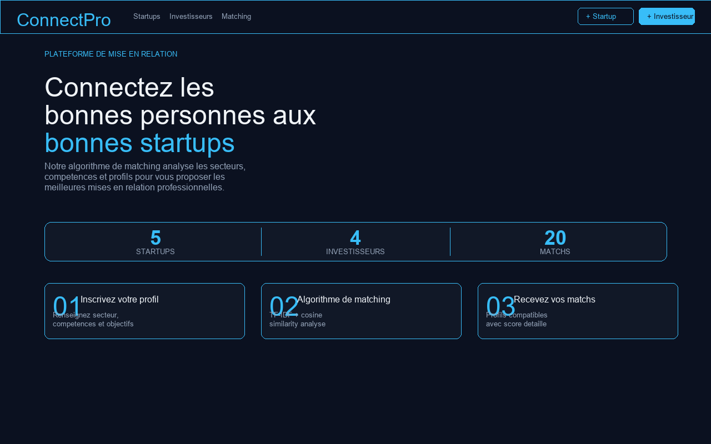
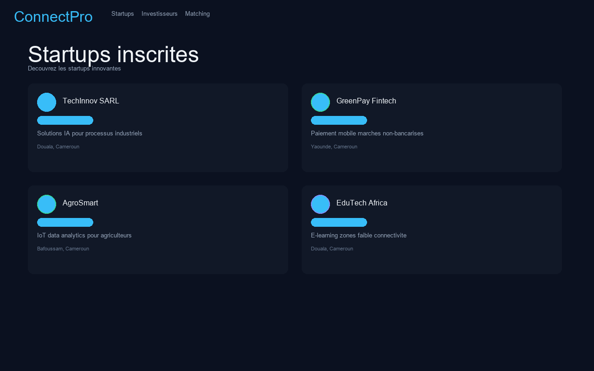
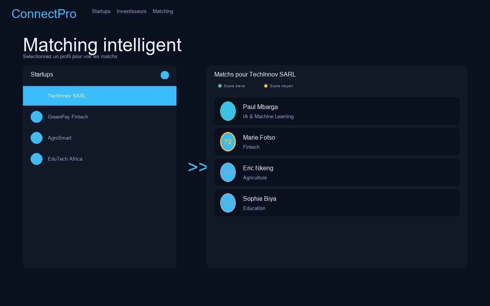

<div align="center">
  
</div>

<div align="center">
  <h1>&#9674; ConnectPro</h1>
  <p><strong>Plateforme de Matching Intelligent — Startups & Investisseurs</strong></p>
  <p>Algorithme TF-IDF + similarité cosinus pour connecter les bonnes personnes aux bonnes startups en Afrique.</p>
  <br>
  <a href="https://vercel.com/new/clone?repository-url=https%3A%2F%2Fgithub.com%2FAB-cloud-cyber%2FCONNECT-PRO&env=DB_HOST,DB_PORT,DB_NAME,DB_USER,DB_PASSWORD,SECRET_KEY&project-name=connectpro&repository-name=CONNECT-PRO">
    
  </a>

  **&#8203;**

  [](https://connectpro-eight.vercel.app)
  [](https://github.com/AB-cloud-cyber/CONNECT-PRO)
</div>

---

## Captures d'écran

| Accueil | Startups | Matching |
|:-------:|:--------:|:--------:|
|  |  |  |

[➡ Voir la démo live](https://connectpro-eight.vercel.app)

---

## ✨ Fonctionnalités

- **Dashboard interactif** — Vue globale des startups, investisseurs et matchs
- **Matching intelligent** — Score de compatibilité basé sur secteur, compétences, localisation et description
- **Interface React** — SPA moderne et réactive
- **API REST** — 7 endpoints pour intégration externe
- **PWA** — Installable sur Android et PC comme une application native

## 🚀 Déploiement

### Prérequis
1. [Compte Vercel](https://vercel.com) (gratuit)
2. [Base PostgreSQL](https://neon.tech) (gratuit)

### 1 clic
[](https://vercel.com/new/clone?repository-url=https%3A%2F%2Fgithub.com%2FAB-cloud-cyber%2FCONNECT-PRO&env=DB_HOST,DB_PORT,DB_NAME,DB_USER,DB_PASSWORD,SECRET_KEY&project-name=connectpro&repository-name=CONNECT-PRO)

### Manuel
```bash
git clone https://github.com/AB-cloud-cyber/CONNECT-PRO.git
cd CONNECT-PRO
cp .env.example .env
# Editer .env avec vos identifiants Neon/PostgreSQL
vercel --prod
```

## 🛠️ Stack Technique

- **Backend** : Python / Flask
- **Frontend** : React 18 (CDN, sans build)
- **Base de données** : PostgreSQL (via Neon)
- **Matching** : TF-IDF + similarité cosinus (NumPy)
- **Hébergement** : Vercel (serverless)

## 📊 API Endpoints

| Route | Description |
|-------|-------------|
| `GET /api/stats` | Statistiques globales |
| `GET /api/entreprises` | Liste des startups |
| `GET /api/entreprises/<id>` | Détail d'une startup |
| `GET /api/chefs` | Liste des investisseurs |
| `GET /api/chefs/<id>` | Détail d'un investisseur |
| `GET /api/match/startup/<id>` | Matchs pour une startup |
| `GET /api/match/chef/<id>` | Matchs pour un investisseur |

## 📝 Licence

MIT
